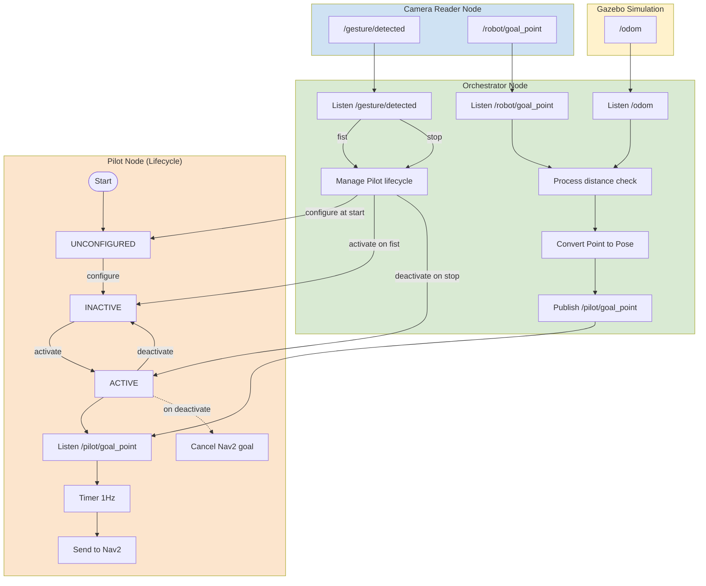

# Turtlebot3

<p align=center>
    <br/>
    <a href="https://releases.ubuntu.com/noble/">
        
    </a>
    <a href="https://docs.ros.org/en/jazzy/index.html">
        
    </a><br />
    <span>Project realized by <a href="https://github.com/06Games">Evan Galli</a>, <a href="https://github.com/LubratJilian">Jilian Lubrat</a>, <a href="https://github.com/eliotmnrt">Eliot Menoret</a> and <a href="https://github.com/mantoniu">Antoine-Marie Michelozzi</a>
    <br/>as part of the <b>Autonomous Intelligent Systems</b> and <b>Edge computing & Embedded AI</b> courses.</span>
</p>

## Features

* Person recognition: The bot exclusively recognizes and obeys commands from its "master".
* Hand-gesture control: Use hand signals to pair with the bot and direct its actions.
* Person following: The bot actively tracks and follows the "master" until signaled to stop.

## Hardware

* Turtlebot3
* Luxonis OAK-D Pro 3d camera

## Installation

> Ensure that the directory path contains no spaces to avoid any issues during execution.

Install [ROS Humble](https://docs.ros.org/en/humble/index.html) and [uv](https://docs.astral.sh/uv/) to run this project

Then install the following packages:

```sh
curl -LsSf https://astral.sh/uv/install.sh | sh
source $HOME/.local/bin/env
sudo apt install ros-humble-depthai-ros ros-humble-turtlebot3-navigation2 build-essential python3-pip python3-venv  ros-humble-foxglove-bridge
pip install --break-system-packages ultralytics depthai
echo "source /opt/ros/humble/setup.bash" >> ~/.bashrc
source ~/.bashrc
```

Setup the Luxonis OAK-D Pro camera by following the instructions [here](https://docs.luxonis.com/hardware/platform/deploy/usb-deployment-guide/).

## Usage

* `make sim` to start the project in simulation mode
* `make deploy` to start the project in a deployed environment
* `make real` to start the project on a computer connected to the Turtlebot3
* `make teleop` to manually control the robot with keyboard inputs
* `make clean` to clean the workspace
* `make mass_shooting` to kill all remaining simulation processes

> Do not run the simulation on a Raspberry Pi, use a standard PC instead for better performance

## Packages

### Camera Reader

The camera_reader is the package responsible for:

* Launching the camera and its associated AI model.
* Processing camera and model outputs directly on the device.
* Running the gesture detection model.
* Processing the gesture detection model’s output.
* Publishing the target point to a ROS topic.
* Publishing the detected gesture associated with the image.

This is the primary package for all image-related process management. Everything is integrated within the same package to avoid transmitting raw images over ROS topics, which would be too resource-intensive to ensure the high performance required for real-time gesture detection inference.

**Detailed Workflow:**

1. **Initialization:** The package's first role is to establish a connection with the camera and create the data pipeline. This pipeline includes:
    * An acquisition node for both color and depth images (using stereo cameras).
    * A neural network node running YOLOv11 Nano Segmentation to detect people in the frame.


2. **Data Processing:** The pipeline outputs model data, which is processed by a set of utility functions and a yolo_api to determine bounding boxes and segmentation masks. The raw image, depth map, and 3D point cloud are also retrieved.
3. **Gesture Detection:** A specific person is cropped from the output image based on their bounding box. This cropped image is then fed into the gesture detection model to identify the specific gesture being performed.
4. **Spatial Localization:** Simultaneously, the depth image is coupled with the segmentation mask to calculate the distance to the person. This defines a point in camera space, which is then converted into map space coordinates via a coordinate transformation.
5. **ROS Outputs:** Finally, the coordinates are sent to the `robot/goal_point` ROS topic as a *PointStamped* message, and the gesture is sent to `gesture/detected` as a *String*. These are then used by the orchestrator.

### Camera Reader Simulation

This package contains the same logic as the camera_reader package, re-implemented specifically for simulation environments. Since simulation does not involve physical hardware, the sections dedicated to camera connection and internal hardware pipeline creation are omitted.

**Key Differences:**

* **Data Source:** The YOLO model is loaded locally, and inference is performed directly on the image streams received via the `/rgb_camera/image` and `/depth_camera/image` ROS topics from the simulation.
* **Pipeline:** There is no pipeline sent to an external processor (such as an OAK-D), all processing is handled by the simulation computer's CPU/GPU.

The remaining functionality, including mask processing, gesture detection, and coordinate transformations, remains strictly identical to the physical version.

### Turtlebot3 Pilot

The pilot package is responsible for sending a PoseStamped message to Nav2 to calculate the path required to reach a destination. This PoseStamped is received via the `/pilot/goal_point` ROS topic.

## Orchestrator

### Managed Nodes (ROS 2 Lifecycle)

ROS 2 provides the concept of **managed nodes**, also called **LifecycleNodes**. Unlike regular nodes, a LifecycleNode follows a predefined state machine that allows its execution to be explicitly controlled at runtime.

A managed node transitions between steady states (`unconfigured`, `inactive`, `active`) using explicit transitions such as `configure`, `activate`, and `deactivate`.  

This makes it possible to start or stop a node’s behavior deterministically, without restarting the node itself.

### Usage in this project

In this project, the navigation **Pilot node** is implemented as a **LifecycleNode** and is controlled by the **Orchestrator**.

The **Orchestrator** centralizes all high-level decision logic:
- It listens to gesture commands via `/gesture/detected` from the **Camera Reader Node** to control the Pilot lifecycle (`fist` to activate, `stop` to deactivate).
- It subscribes to `/robot/goal_point` (Camera Reader) and `/odom` (Gazebo) and preprocesses navigation goals before forwarding them to the Pilot.
- It applies goal update filtering, ensuring that a new target is sufficiently different from the previously forwarded one before being sent to the Pilot.
- It performs the conversion and validation from `PointStamped` to `PoseStamped`, forwarding only preprocessed navigation goals to the Pilot.

Only when the Pilot is active and the new goal is considered valid does the orchestrator forward a preprocessed `PoseStamped` message to `/pilot/goal_point`.

This design keeps the Pilot node simple and focused on navigation execution, while the orchestrator handles gesture control, safety checks, and goal validation.

### Architecture overview


